# nestjs
## setup

install nestjs cli

```bash

sudo yarn global add @nestjs/cli

```

create a new project using nest cli

```bash

nest new task-management

```
> it will generate boilerplate code for us to start with
> more cli options are listed [here](https://docs.nestjs.com/cli/usages)

add fastify as well
```bash

yarn add @nestjs/platform-fastify

```
> note: when using fastify their are some changes that we need to make. that we will cover later [ref](https://docs.nestjs.com/techniques/performance)

## add a new module
generate new module using nest cli
```bash

nest g module tasks

```

>  nest g module <_name of module_>
>  here `g module` means generate module
>  this command performs two actions
>  1. CREATE src/tasks/tasks.module.ts
> 	 ```typescript
> 	 import { Module } from '@nestjs/common';
> 	 @Module({})
> 	 export class TasksModule {}
> 	 ```
>  2. UPDATE src/app.module.ts
> 	 ```typescript
> 	 import { Module } from '@nestjs/common';
> 	 import { TasksModule } from './tasks/tasks.module';
> 	@Module({
> 	  imports: [TasksModule],
> 	  })
> 	  export class AppModule {}
> 	 ```
>
> 	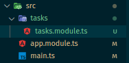

## Controllers, Handler
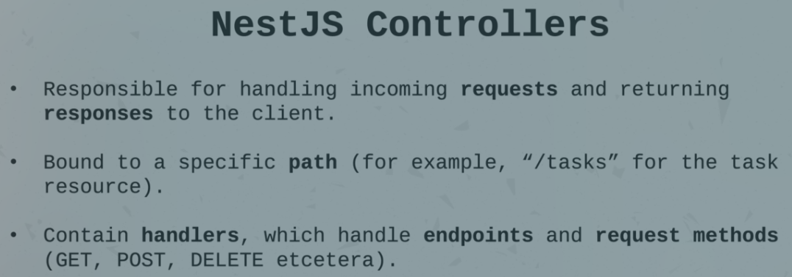

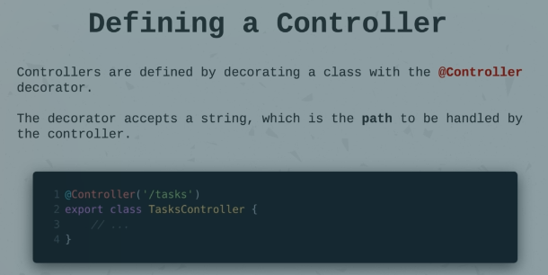

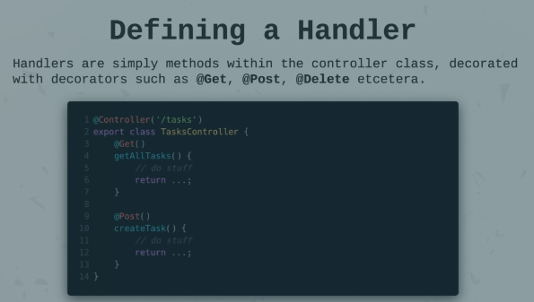

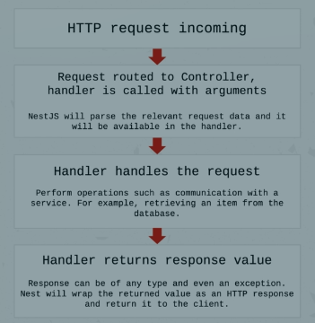


generate controller
```bash
nest g co tasks
nest g co tasks --no-spec
```
 > nest g < schematic > < name > [options]
 > this command performs three actions
>  1.  CREATE src/tasks/tasks.controller.spec.ts (it contains test cases) genereted only if --no-spec is not used
>  2. CREATE src/tasks/tasks.controller.ts
>	```typescript
>		import { Controller } from '@nestjs/common';
>		@Controller('tasks')
>		export class TasksController {}
>	```
>	3 UPDATE src/tasks/tasks.module.ts
>	```typescript
>		import { Module } from '@nestjs/common';
>		import { TasksController } from './tasks.controller';
>		@Module({
>			 controllers: [TasksController],
>		})
>		export class TasksModule {}
>	```
>	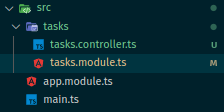

> Note: if module of the same name doesn't exists, it will directly register the controller in root module, i.e AppModule

##  Providers aka Service and CRUD operation


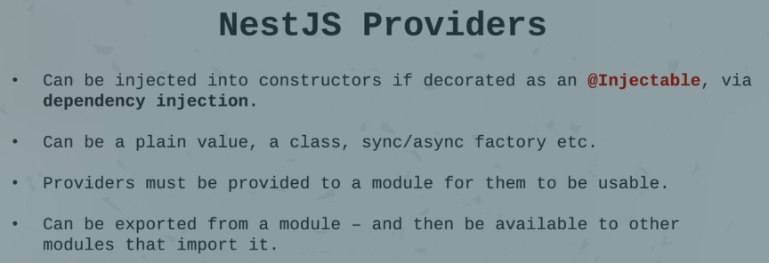

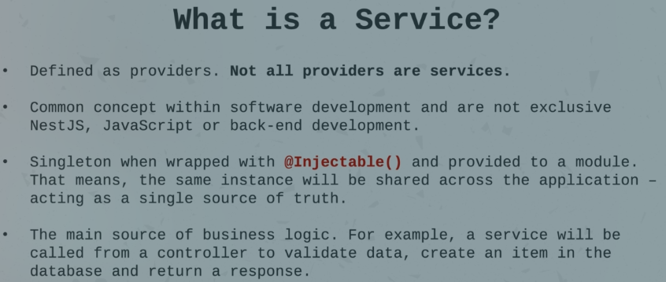

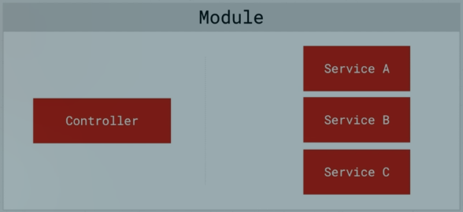

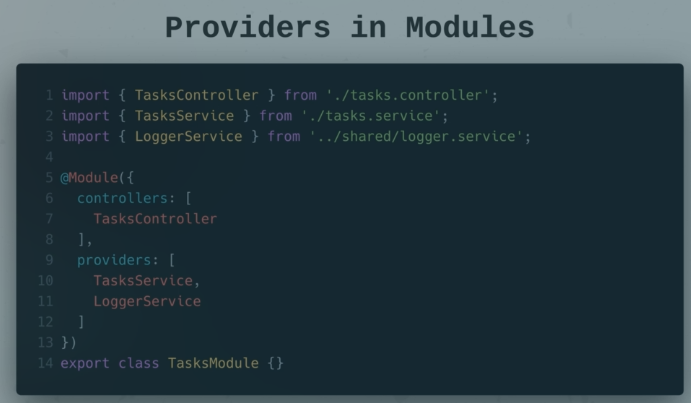

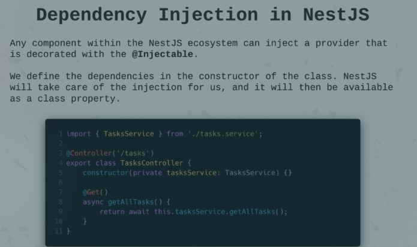


generate service
```bash
nest g s tasks --no-spec
```
 > this command performs two actions
>  1. CREATE src/tasks/tasks.service.ts
>	```typescript
>		import { Injectable } from '@nestjs/common';
>		@Injectable()
>		export class TasksService {}
>	```
>	3 UPDATE src/tasks/tasks.module.ts
>	```typescript
>		import { Module } from '@nestjs/common';
>		import { TasksController } from './tasks.controller';
>		import { TasksService } from './tasks.service';
>		@Module({
>			 controllers: [TasksController],
>			 providers: [TasksService], // register service aka provider
>		})
>		export class TasksModule {}
>	```
>	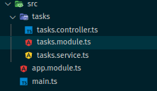

> *** We can inject service to controller when both are part of the same module ***
### Dependeny Injection
*dependency injection is done within the constructor of the class in nestjs*

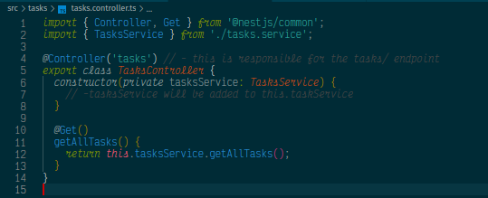

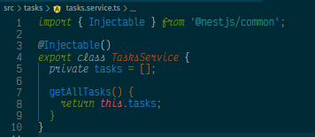

### DTO (Data Transfer Object)
Problem: ***changing shape require lot of work, and here DTO comes into picture***

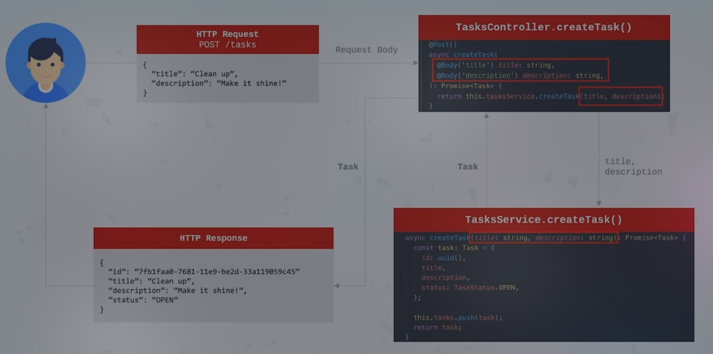

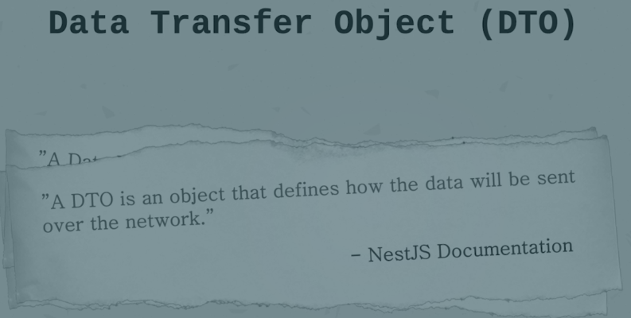

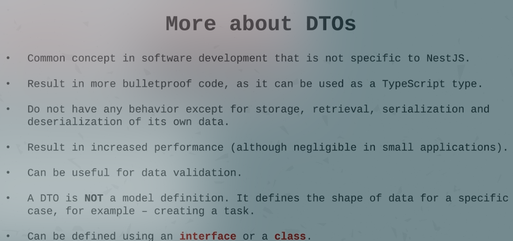

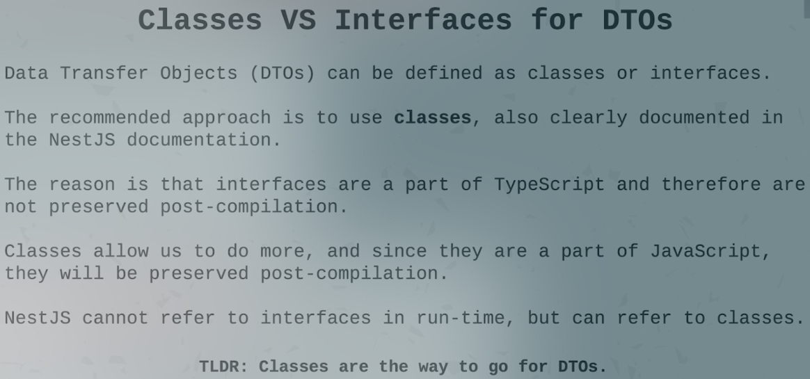

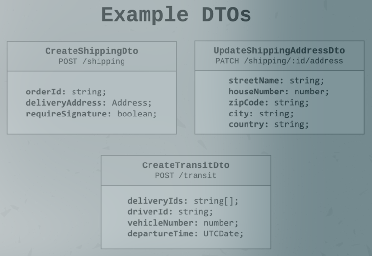

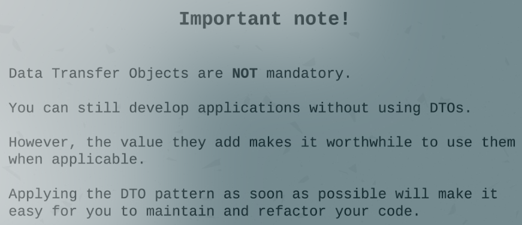

### CRUD
*controller*
```typescript
import { Body, Controller, Delete, Get, Param, Post, Patch } from '@nestjs/common';
import { ETaskStatus } from './task.model';
import { TasksService } from './tasks.service';

@Controller('tasks') // - this is responsible for the tasks/ endpoint
export class TasksController {
  constructor(private tasksService: TasksService) {
    // -tasksService will be added to this.taskService
  }

  @Get()
  getAllTasks() {
    return this.tasksService.getAll();
  }

  @Get('/:id')
  getTask(@Param('id') id: string) {
    return this.tasksService.getTaskById(id);
  }

  @Post('/create')
  createTask(@Body('title') title: string, @Body('description') description: string) {
    return this.tasksService.create(title, description);
  }

  @Delete('/:id')
  deleteTask(@Param('id') id: string) {
    return this.tasksService.deleteTaskById(id);
  }

  @Patch()
  updateTask(@Body('id') id: string, @Body('title') title: string, @Body('description') description: string, @Body('status') status: ETaskStatus) {
    return this.tasksService.updateTaskById(id, title, description, status);
  }
}
```
*service*

```typescript
import { Injectable } from '@nestjs/common';
import { ETaskStatus, ITask } from './task.model';
// import { nanoid } from 'nanoid';

@Injectable()
export class TasksService {
  private tasks: ITask[] = [];

  getAll(): ITask[] {
    return this.tasks;
  }

  getTaskById(id: string): ITask | Record<string, never> {
    const task = this.tasks.find((t) => t.id == id);
    return task ?? {};
  }

  deleteTaskById(id: string): ITask | Record<string, never> {
    const taskIndex = this.tasks.findIndex((t) => t.id == id);
    const [task] = this.tasks.splice(taskIndex, 1);
    return task ?? {};
  }

  updateTaskById(id: string, title: string, description: string, status: ETaskStatus): ITask | Record<string, never> {
    const taskIndex = this.tasks.findIndex((t) => t.id == id);
    this.tasks[taskIndex].title = title ?? this.tasks[taskIndex].title;
    this.tasks[taskIndex].description = description ?? this.tasks[taskIndex].description;
    this.tasks[taskIndex].status = status ?? this.tasks[taskIndex].status;
    return this.tasks[taskIndex] ?? {};
  }

  create(title: string, description: string): ITask {
    const task: ITask = {
      // id: nanoid(5), // - require() of ES Module not supported. Instead change the require of index.js to a dynamic import() which is available in all CommonJS modules.
      id: (this.tasks.length + 1).toString(),
      title: title,
      description: description,
      status: ETaskStatus.OPEN,
    };
    this.tasks.push(task);
    return task;
  }
}
```